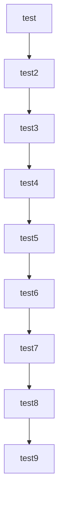

<!-- generated by mermaid compile action - START -->

```mermaid
graph TD
    test --> test2
    test2 --> test3
    test3 --> test4
    test4 --> test5
    test5 --> test6
    test6 --> test7
    test7 --> test8
    test8 --> test9
```

<!-- generated by mermaid compile action - END -->
